<div align="center">
  <picture>
    <source media="(prefers-color-scheme: dark)" srcset="dark.svg">
    <source media="(prefers-color-scheme: light)" srcset="light.svg">
    
  </picture>
</div>

<br/>

## 🎯 About Me

```bash
cat << 'EOF'
> Cybersecurity Engineering Student specializing in Penetration Testing, AI Security Research, & Malware Analysis.
> Certified Ethical Hacker (CEH) with hands-on expertise in Red Team operations & Enterprise SOC automation pipelines.
EOF
```

### 🎯 Professional Summary
Computer Science Engineering student specializing in **Cybersecurity**, **AI Security Research**, and **Red Team Operations**. Hands-on experience in penetration testing, malware analysis, automated SOC incident triage, Windows post-exploitation, and hardware security. Certified Ethical Hacker (CEH) with a strong track record of engineering open-source security research tools, custom LLM security frameworks, and enterprise-grade lab automation pipelines.

---

### 🛠️ Technical Skills

- **Programming & Scripting:** Python, Bash, PowerShell, C/C++, JavaScript, HTML5/CSS3, SQL
- **Cybersecurity Domains:** Penetration Testing, Vulnerability Assessment, Malware Analysis & Reverse Engineering, SOC Triage & Incident Response, Red Teaming, LLM & AI Security, Hardware/IoT Security, Active Directory Exploitation
- **Security Tools:** Burp Suite Professional, OWASP ZAP, Nmap, Wireshark, Metasploit, SQLMap, Gobuster, Hydra, John the Ripper, Aircrack-ng, MobSF, Sysmon
- **SIEM & Automation:** Wazuh SIEM/XDR, n8n Workflow Engine, Docker, AbuseIPDB API, VirusTotal API, Ollama / OpenAI API
- **Platforms & OS:** Kali Linux, Ubuntu Server, Windows Server 2025 (Active Directory DC), Windows 10/11, macOS, TryHackMe, Hack The Box, PortSwigger

---

### 🚀 Featured Security Projects

- 🛡️ **`soc-n8n-lab`**: Multi-node Enterprise Security Lab (Wazuh SIEM/XDR, n8n Automation Engine, Windows AD DC, Kali, Docker) with automated AI Alert Triage & Active Defense.
- 🦆 **`DRduckyai` (DuckyBuilder)**: AI-Powered HID Payload Generator platform using Flask, SQLite, and Gemini for Hak5 USB Rubber Ducky, Flipper Zero BadUSB, & Bash Bunny.
- 🔬 **`warepy` (WarePy)**: Specialized LLM Security Research & Prompt Injection Framework with 100+ controlled adversarial experiments + Windows post-exploitation modules (UAC/AMSI Bypass, ETW Patching).
- 🧩 **`ccaiast` (CCAIAST)**: 4-module AI-assisted framework for malware analysis, automated IOC extraction, exploit research, & incident response triage.
- ⚡ **`esp32_lab_implant`**: Custom ESP32 hardware implants for wireless security testing & HID automation labs.

---

### 📜 Certifications
- 🛡️ **Certified Ethical Hacker (CEH)** — EC-Council
- ⚔️ **Certified Penetration Testing Professional (CPENT)** *(In Progress)*
- 🔍 **SOC Level 1 Analyst** *(In Progress)*
- 🦠 **Malware Analysis Certification**
- 🌐 **Cisco Network Security & Introduction to Cybersecurity**

---

<div align="center">
  <sub>Built with ❤️ by <b>Bhuvan Kumar H M</b> (<a href="https://github.com/B2Kmonster">@B2Kmonster</a>)</sub>
</div>
